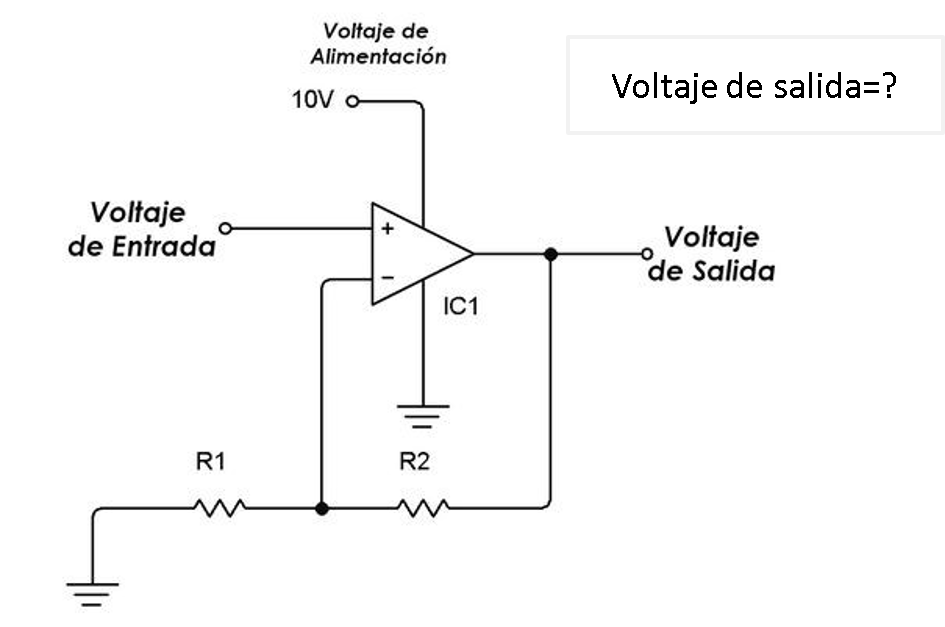
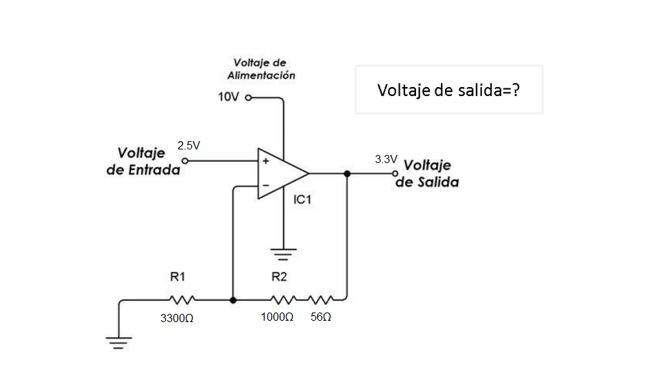

# Sensores
## :trophy: C1.4 Reto en clase

Circuito electrónico para el acondicionamiento de señal con un amplificador operacional

### :blue_book: Instrucciones

___

- De acuerdo con la información presentada por el asesor referente al tema acondicionadores de señal, contestar lo que se indica dentro del apartado desarrollo.

- Toda actividad o reto se deberá realizar utilizando el estilo **MarkDown con extension .md** y el entorno de desarrollo VSCode, debiendo ser elaborado como un documento **single page**, es decir si el documento cuanta con imágenes, enlaces o cualquier documento externo debe ser accedido desde etiquetas y enlaces.
- Es requisito que el archivo .md contenga una etiqueta del enlace al repositorio de su documento en Github, por ejemplo **Enlace a mi GitHub**
- Al concluir el reto el reto se deberá subir a github el archivo .md creado.
- Desde el archivo **.md** se debe exportar un archivo **.pdf** con la nomenclatura **C1.4_NombreAlumno_Equipo.pdf**, el cual deberá subirse a classroom dentro de su apartado correspondiente, para que sirva como evidencia de su entrega; siendo esta plataforma **oficial** aquí se recibirá la calificación de su actividad por individual.
- Considerando que el archivo .pdf, fue obtenido desde archivo .md, ambos deben ser idénticos y mostrar el mismo contenido.
- Su repositorio ademas de que debe contar con un archivo **readme**.md dentro de su directorio raíz, con la información como datos del estudiante, equipo de trabajo, materia, carrera, datos del asesor, e incluso logotipo o imágenes, debe tener un apartado de contenidos o indice, los cuales realmente son ligas o **enlaces a sus documentos .md**, _evite utilizar texto_ para indicar enlaces internos o externo.
- Se propone una estructura tal como esta indicada abajo, sin embargo puede utilizarse cualquier otra que le apoye para organizar su repositorio.

```  
| readme.md
| | blog
| | | C0.1_x.md
| | | C0.2_x.md
| | | C0.3_x.md
| | img
| | docs
| | | A0.1_x.md
| | | A0.2_x.md
```


## :pencil2: Desarrollo

___

**Problema a resolver:**

1. Calcular el valor de R1 y R2 que se requiere, para obtener una voltaje de salida de 3.3v, dado que el Voltaje de entrada es de 2.5v? Explique el procedimiento utilizado para realizar el calculo y considere valores comerciales para las resistencias que se considere utilizar.




**V**salida = **V**entrada * (1 + (R2 / R1))

Despejamos R2/R1.....

R2/R1 = (**V**salida - **V**entrada)/**V**entrada

Sustituimos valores de voltajes.....

R2/R1 = (3.3V - 2.5V)/2.5V

R2/R1 = 0.32

Necesitamos dos resistencias que al ser divididas den 0.32 como resultado y que además estén disponibles de manera comercial.....

Para esto podemos despejar R2 y encontramos que el valor de R2 debe ser igual a 0.32 veces lo que vale R1.

R2 = 0.32 * R1

Después de diversas pruebas encontramos que R2 puede ser igual a **1056Ω** y R1 debe ser igual a **3300Ω** ya que R2 puede formarse a partir de un arreglo en serie de una resistencia de 1kΩ y una de 56Ω mientras que R1 simplemente utilizamos una de 3300Ω existente en el mercado. 

Si hacemos el cálculo.....

R2/R1 = 0.32

1056Ω/3300Ω = 0.32

Podemos comprobar que para obtener un voltaje de salida de 3.3V dado que tenemos 2.5V de entrada en nuestro circuito necesitaremos un valor de 1056Ω (1000Ω + 56Ω en serie) en R2 y otro de 3300Ω en R1.


___

### :bomb: Rubrica

| Criterios     | Descripción                                                                                  | Puntaje |
| ------------- | -------------------------------------------------------------------------------------------- | ------- |
| Instrucciones | Se cumple con cada uno de los puntos indicados dentro del apartado Instrucciones?            | 20 |
| Desarrollo    | Se respondió a cada uno de los puntos solicitados dentro del desarrollo de la actividad?     | 80      |

:house: [Ir a mi github](https://github.com/Gabriel123x/Sistemas_Programables.git)