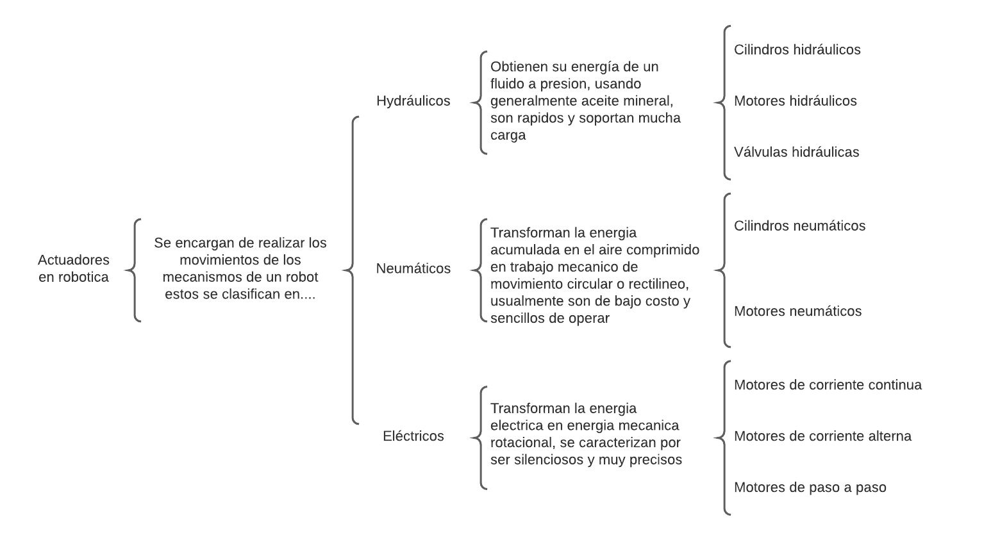
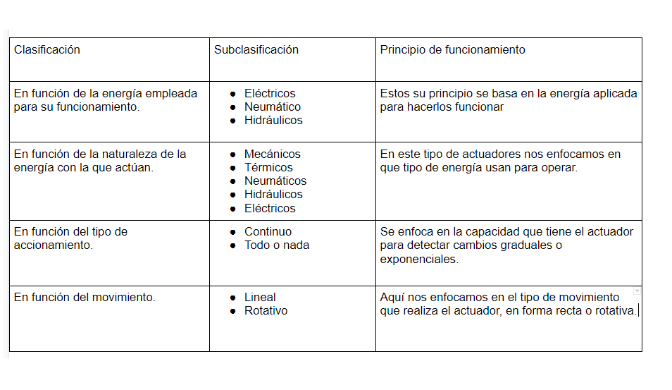
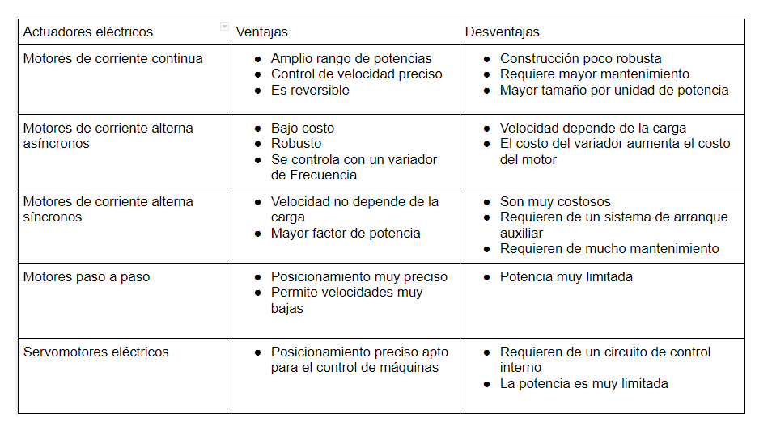

# Actuadores

## :trophy: C2.1 Reto en clase

**Actuadores Neumatico e Hidraulicos, y sus tipos**

### :blue_book: Instrucciones

- De acuerdo con la información presentada por el asesor referente al tema actuadores y a los videos observados sobre el mismo tema, elabore lo que se solicita dentro del apartado desarrollo.
- Toda actividad o reto se deberá realizar utilizando el estilo **MarkDown con extension .md** y el entorno de desarrollo VSCode, debiendo ser elaborado como un documento **single page**, es decir si el documento cuanta con imágenes, enlaces o cualquier documento externo debe ser accedido desde etiquetas y enlaces.
- Es requisito que el archivo .md contenga una etiqueta del enlace al repositorio de su documento en Github, por ejemplo **Enlace a mi GitHub**
- Al concluir el reto el reto se deberá subir a github el archivo .md creado.
- Desde el archivo **.md** se debe exportar un archivo **.pdf** con la nomenclatura **C2.1_NombreAlumno_Equipo.pdf**, el cual deberá subirse a classroom dentro de su apartado correspondiente, para que sirva como evidencia de su entrega; siendo esta plataforma **oficial** aquí se recibirá la calificación de su actividad por individual.
- Considerando que el archivo .pdf, fue obtenido desde archivo .md, ambos deben ser idénticos y mostrar el mismo contenido.
- Su repositorio ademas de que debe contar con un archivo **readme**.md dentro de su directorio raíz, con la información como datos del estudiante, equipo de trabajo, materia, carrera, datos del asesor, e incluso logotipo o imágenes, debe tener un apartado de contenidos o indice, los cuales realmente son ligas o **enlaces a sus documentos .md**, _evite utilizar texto_ para indicar enlaces internos o externo.
- Se propone una estructura tal como esta indicada abajo, sin embargo puede utilizarse cualquier otra que le apoye para organizar su repositorio.  
``` 
| readme.md
| | blog
| | | C2.1_x.md
| | | C2.2_x.md
| | | C2.3_x.md
| | img
| | docs
| | | A2.1_x.md
| | | A2.2_x.md
```

### :pencil2: Desarrollo

Listado de preguntas:

1. Basándose en el video [actuadores en Robótica](https://www.youtube.com/watch?v=e_6rjEGWqoY), realice un cuadro sinóptico sobre la clasificación de los actuadores.
- 
2. De acuerdo con el video [descripcion de los actuadores industriales](https://www.youtube.com/watch?v=mFsPxpFHajM) realice una matriz comparativa indicando clasificacion, subclasificacion, principio de funcionamiento, ventajas y desventajas.
- 
- 
3. De acuerdo con el video [Neumática Industrial](https://www.youtube.com/watch?v=Wee85cI6wwQ&t=394s), explique como trabaja un sistema Neumático?
- El objetivo principal de un sistema neumático es generar movimiento usando la presión del aire, este movimiento después será utilizado en otras aplicaciones que nos ayuden a resolver alguna problemática.
- La primera parte de un sistema neumático es el compresor de aire, la menara en que funciona es muy simple esta máquina al estar operando constantemente toma aire del ambiente y en su interior lo comprime a presión, seguido de eso este "aire comprimido" es mandado a través de tubos a la segunda fase de nuestro sistema neumático.
- El aire comprimido es mandado a la unidad de preparación de aire, donde primero pasa por un separador de líquidos el cual se encarga de remover cualquier humedad que se encuentre en el aire comprimido, despues a traves de filtros eliminamos aun mas humedad, seguido pasamos por un regulador que nos permite accionar cuanta presión deseamos para nuestro sistema neumático si queremos más fuerza aumentamos la presión, de aquí pasamos el aire a nuestra siguiente fase la válvula de control direccional.
- En la válvula de control direccional nos permite controlar en qué parte del sistema deseamos realizar movimiento, dependiendo de qué posición coloquemos este sistema indicaremos hacia donde queremos dirigir el flujo de aire. Si este sistema está automatizado usualmente se utiliza un PLC para controlarlo.  
- El siguiente componente del sistema es el actuador que realiza el "movimiento" utilizando la energía del aire comprimido, aquí es donde realizamos el trabajo "útil" que vamos a hacer este puede estar ajustado en diferentes configuraciones para cumplir con nuestro objetivo. Con la válvula de control podemos modificar el comportamiento de nuestro actuador y así cambiar su dirección. 


### :bomb: Rubrica

| Criterios     | Descripción                                                                                  | Puntaje |
| ------------- | -------------------------------------------------------------------------------------------- | ------- |
| Instrucciones | Se cumple con cada uno de los puntos indicados dentro del apartado Instrucciones?            | 20 |
| Desarrollo    | Se respondió a cada uno de los puntos solicitados dentro del desarrollo de la actividad?     | 80      |

:house: [Ir a mi github](https://github.com/Gabriel123x/Sistemas_Programables.git)